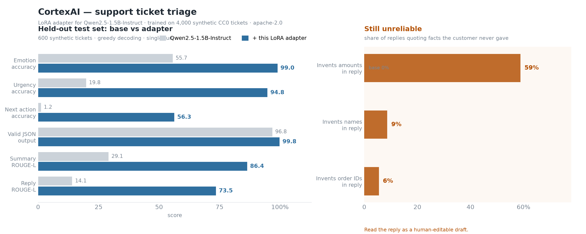

# Model Card for SupportLM V1.0.2 — support ticket triage

A LoRA adapter that turns [`Qwen/Qwen2.5-1.5B-Instruct`](https://huggingface.co/Qwen/Qwen2.5-1.5B-Instruct)
into a structured customer-support triage assistant. Given one support message it
returns a single JSON object with five fields: `emotion`, `urgency`, `summary`,
`next_action`, and `suggested_reply`.

**Adapter only.** This repository contains the 10.6M-parameter LoRA delta
(~40 MB). Load it alongside the base model; the base weights are not included.



## Model Details

### Model Description

- **Developed by:** Om Patil
- **Model type:** LoRA adapter (PEFT) for a decoder-only text-generation model
- **Language(s) (NLP):** English
- **License:** apache-2.0, as a derivative of the base model.
- **Finetuned from model:** [`Qwen/Qwen2.5-1.5B-Instruct`](https://huggingface.co/Qwen/Qwen2.5-1.5B-Instruct)

### Model Sources

- **Paper:** none. This model has not been published in a paper.

### Intended inputs and outputs

Input is a single customer support message as plain text. Output is one JSON
object:

```json
{
  "emotion": "Angry | Frustrated | Confused | Anxious | Neutral | Polite | Happy",
  "urgency": "Low | Medium | High | Critical",
  "summary": "one sentence, at most 25 words, stating what the customer wants",
  "next_action": "one of 42 fixed ACTION_CONSTANT values",
  "suggested_reply": "short, professional, empathetic reply to send as-is"
}
```

`next_action` is drawn from a closed list of 42 constants (`FIX_PAYMENT`,
`CHECK_SHIPMENT`, `PROCESS_REFUND`, `ESCALATE_HUMAN`, …). The full enumeration
The full enumeration of the 42 constants is listed in the Output format block above.

The adapter is instructed to write unknown specifics as `[ORDER_ID]`, `[DATE]`
or `[AMOUNT]` rather than inventing them.

## Uses

### Direct Use

Intended for **routing and drafting support work**: triage a ticket's emotion and
urgency, summarise what the customer wants, propose the next agent action, and
draft a reply for a human to edit.

```bash
pip install transformers peft torch
```

```python
import json
import torch
from peft import PeftModel
from transformers import AutoModelForCausalLM, AutoTokenizer

BASE = "Qwen/Qwen2.5-1.5B-Instruct"

tok = AutoTokenizer.from_pretrained(BASE)
model = PeftModel.from_pretrained(
    AutoModelForCausalLM.from_pretrained(BASE, dtype=torch.bfloat16),
    "Ompatil19/SupportLM_V1.0.2",            # or a local path
).eval()

SYSTEM = (
    "You are SupportLM, a customer support triage assistant.\n\n"
    "Read the customer's support message and reply with a single JSON object "
    "and nothing else.\nKeys, in this order:\n"
    "- emotion\n- urgency\n- summary\n- next_action\n- suggested_reply\n\n"
    "Never invent specifics that the customer did not provide. If an order number, "
    "date, amount or address is needed but missing, ask for it in the reply and "
    "write it as [ORDER_ID], [DATE] or [AMOUNT] rather than guessing."
)

prompt = tok.apply_chat_template(
    [
        {"role": "system", "content": SYSTEM},
        {"role": "user", "content": (
            "Customer: My payment was declined for order [ORDER_ID] and I need "
            "this fixed today, it is urgent."
        )},
    ],
    tokenize=False,
    add_generation_prompt=True,
)

ids = tok(prompt, return_tensors="pt", add_special_tokens=False).input_ids
out = model.generate(ids, max_new_tokens=320, do_sample=False)
print(json.loads(tok.decode(out[0][ids.shape[1]:], skip_special_tokens=True)))
```

The short prompt above is what the adapter was trained on: same instruction
shape, same field list, same ordering. Substituting a different format or
dropping the field list will degrade results.

One caveat on the assistant name. Every fine-tuning row used a different persona
name than the one shown here, so the name in the system prompt is a mild
distribution shift the adapter has not seen. Predictions were identical in a
10-row spot check, but this was not measured across the full test set, so treat
the reported metrics as applying to the trained name. If you need the exact
trained configuration, use that name in the prompt; nothing else in this card
depends on it, since the persona never appears in the model's output.

### Out-of-Scope Use

- **Do not send `suggested_reply` to a customer unmodified.** It fabricates
  amounts in ~59% of replies (see [Limitations](#bias-risks-and-limitations)).
- **Do not let `next_action` trigger automated workflows.** At 56% accuracy it is a
  prioritisation hint, not an executable decision.
- **Not for direct customer-facing use.** No safety or privacy evaluation was done.
- **English only**, and trained on one fictional retail brand (ShopNova) plus
  healthcare- and finance-adjacent intents.
- **Not adversarially robust.** Ticket text is untrusted input and was never
  attacked during evaluation. Treat any ticket as a prompt-injection vector.

## Bias, Risks, and Limitations

Measured on 600 held-out tickets; full table under [Evaluation](#evaluation).

- **`suggested_reply` fabricates specifics ~59% of the time** (amounts), 8.7%
  (names), 5.5% (order IDs). This is the most serious limitation. The field is a
  draft for a human to edit, not sendable copy. Validate or template any part
  that quotes figures.
- **`next_action` is 56.3% accurate.** The taxonomy is imbalanced — ~23% of test
  tickets map to a single action, so the majority class alone scores higher than
  the model. The base model emits a correct action only by accident (1.2%).
- **Training data is entirely synthetic** (`llm_generated_v6_augmented`, CC0-1.0).
  It has never seen real support tickets and is unvalidated on production
  phrasing. Expect topic drift on live data.
- **Single-turn only.** No conversation threads in training; multi-turn or
  context-dependent tickets are out of distribution.
- **~14 of ~5,200 summaries were written by Gemini; the rest come from a grounded
  extractive fallback** because free-tier API quota was exhausted mid-run. The
  `summary` field therefore mostly tests summariser behaviour, not model
  behaviour.
- **No safety, privacy, fairness, or red-team evaluation was performed.** Bias
  analysis across demographics, languages, and ticket difficulty was not done.
- **Metrics are from a single greedy-decoding run** on one synthetic holdout. No
  confidence intervals, no seed variance, no cross-validation.

### Recommendations

1. Treat the output as a triage suggestion with a human in the loop, never as an
   approved action.
2. Strip or template numeric fields from `suggested_reply` before it reaches a
   customer, or measure the fabrication rate on your own traffic first.
3. Re-run evaluation on a real, human-labelled sample before relying on any number
   on this card. The synthetic-to-real gap is unmeasured and likely larger than
   the gaps reported here.
4. Add input sanitisation if ticket text can contain attacker-controlled content.

## How to Get Started with the Model

See [Direct Use](#direct-use) for a complete copy-pasteable example. Two
platform notes:

**The adapter is standard PEFT** and runs anywhere with a torch/transformers
stack — Linux, Windows, or a Mac without MLX. This repository has no
Apple-silicon-only dependency.

**It was trained against a 4-bit MLX base** but loads on the *unquantised* base.
The weight update transfers bit-identically, yet predictions differ slightly from
the original MLX run because the base weights differ. Even with no adapter at all,
the 4-bit and fp32 bases disagree on the argmax for identical token ids. Expect
small differences from the numbers below; this is expected, not a bug.

## Training Details

### Training Data

4,000 train / 600 validation / 600 test synthetic customer support tickets,
sampled from a local corpus of 500,700 tickets (CC0-1.0, `llm_generated_v6_augmented`)
covering 22 categories and 87 intents.

The full 500,700-ticket source corpus is not published, but the exact
4,000/600/600 split used here is, so the numbers below are reproducible:

[`Ompatil19/SupportLM-triage-dataset`](https://huggingface.co/datasets/Ompatil19/SupportLM-triage-dataset)

Splits are disjoint by `conversation_id` (verified zero overlap) so no near-duplicate
ticket can appear in both train and test.

### Training Procedure

LoRA fine-tuning of the 4-bit MLX base on Apple Silicon, via `mlx_lm`, using the
`short_system` prompt. No `lr_schedule` (constant rate), `adam` optimizer,
gradient checkpointing on, prompt tokens masked from the loss.

#### Training Hyperparameters

| Parameter | Value |
|---|---|
| Base model | `mlx-community/Qwen2.5-1.5B-Instruct-4bit` |
| LoRA rank | 16 |
| LoRA scale | 32.0 (`lora_alpha` = 32 × 16 = **512**) |
| LoRA dropout | 0.05 |
| Target modules | `q_proj`, `k_proj`, `v_proj`, `o_proj`, `gate_proj`, `up_proj`, `down_proj` |
| Adapted layers | 12–27 (last 16 of 28) |
| Max sequence length | 640 |
| Batch size | 4 |
| Gradient accumulation | 1 |
| Learning rate | 1e-4, constant |
| Optimizer | Adam |
| Seed | 0 |
| Max iterations | 2000 (see below) |
| Training regime | 4-bit quantized base, bf16 compute |

> **`lora_alpha` = 512 is intentional.** MLX applies `scale` directly; PEFT computes
> its multiplier as `alpha / r`. Since `512 / 16 = 32`, the two agree. Changing this
> to 16 or 32 silently rescales the adapter by 32x or 2x and will destroy it.

#### Speeds, Sizes, Times

- Checkpoint used: step 1200. Validation loss bottomed at step 1000 (0.172) and
  rose slightly to 0.198 at 1200, but head-to-head evaluation on 200 test rows
  favoured 1200, so 1200 was promoted.
- The run was stopped at iteration 1350/2000. Per-token validation loss tracks the
  reply prose as much as the labels, so it is a weak model-selection signal; see
  recorded in the checkpoint provenance for this release.
- Full 2-epoch budget on this hardware is ~4h. The earlier 800-row pilot took
  34.3 minutes.

## Evaluation

### Testing Data, Factors & Metrics

600 held-out tickets, disjoint from train and validation by `conversation_id`.
Greedy decoding, one pass, temperature 0.

#### Factors

Not disaggregated. No breakdown by language, locale, ticket difficulty, customer
segment, or intent frequency was performed — a real gap.

#### Metrics

- **Accuracy** for `emotion`, `urgency`, `next_action` (the closed enum makes this
  exact match). Macro-F1 averages only over gold-supported classes.
- **Emotion+urgency exact match** — both labels correct in one response.
- **ROUGE-L** for `summary` and `suggested_reply` against the reference.
- **Fabrication rates** — share of replies quoting amounts, names, or identifiers
  the customer never supplied. Measured because ROUGE-L rewards fluent text and
  cannot distinguish a correct draft from a plausible-sounding invention.

### Results

Base column is the same 600 tickets with no adapter.

| Metric | Base | + this adapter |
|---|---|---|
| Valid JSON output | 96.8% | **99.8%** |
| Emotion accuracy | 55.7% | **99.0%** |
| Emotion macro-F1 | 52.1% | **99.2%** |
| Urgency accuracy | 19.8% | **94.8%** |
| Urgency macro-F1 | 18.0% | **91.5%** |
| Next-action accuracy | 1.2% | **56.3%** |
| Next-action macro-F1 | 0.6% | **45.7%** |
| Emotion + urgency exact match | — | **94.5%** |
| Summary ROUGE-L | 0.291 | **0.864** |
| Reply ROUGE-L | 0.141 | **0.735** |
| Summary invented details | 1.5% | **0.2%** |
| Reply invents amounts | 0.2% | ⚠️ **58.8%** |
| Reply invents names | not measured | ⚠️ **8.7%** |
| Reply invents order IDs | 5.7% | **5.5%** |
| Reply unparseable/truncated | 3.2% | **0.3%** |

Read `next_action` as the honest ceiling: 56.3% is barely above the 23% majority
class. Note also that the adapter *increased* reply fabrication of amounts from
0.2% to 58.8% — ROUGE-L improves while the model becomes more confidently
wrong about figures. That is the trade this card exists to warn about.

#### Summary

The adapter reliably learns the label taxonomy (emotion and urgency are close to
saturated) and produces well-formed, schema-valid output. It does not reliably
ground the free-text reply in facts the customer supplied. Deployment value is in
routing and queue prioritisation, not in automated replies.

Scores can be submitted as Hub Eval Results against
[`Ompatil19/SupportLM-triage-dataset`](https://huggingface.co/datasets/Ompatil19/SupportLM-triage-dataset),
which is registered as a Benchmark via `eval.yaml`. The figures in the table
above were measured on its `test` split and can be reproduced with
`scripts/evaluate.py` in the training repository.

## Environmental Impact

Training ran locally on one machine; no cloud provider or compute region was
involved.

- **Hardware Type:** Apple MacBook Air (M4, 16 GB unified memory), Apple Silicon, no discrete GPU
- **Hours used:** roughly 4 for the full 2-epoch budget; ~2.5 for the 1350 iterations actually run, plus ~1h for pilot training and evaluation
- **Cloud Provider:** none (local)
- **Compute Region:** n/a
- **Carbon Emitted:** not estimated. The [ML CO2 Impact calculator](https://mlco2.github.io/impact#compute) is built around datacentre GPU runs; applying it to a local Apple Silicon machine would produce a number of unclear meaning. Reporting it unmeasured is the honest option.

The adapter is ~40 MB and the base model is ~3 GB, so this is a small artefact
relative to most published models.

## Technical Specifications

### Model Architecture and Objective

LoRA adapters on a frozen `Qwen2ForCausalLM` (28 layers, hidden 1536, 12
attention heads, 2 KV heads, intermediate 8960). 10.6M trainable parameters,
0.30% of the base model. Objective: causal language modelling on the JSON
triage output.

### Hardware

Inference needs ~4 GB for the base model in bf16 plus ~40 MB for the adapter.
`bitsandbytes` 4-bit loading is the practical option for constrained GPUs; PEFT
adapters are quantization-agnostic.

### Software

- Inference: `transformers` 5.18.0, `peft` 0.21.2, `torch` 2.14.1
- Training: `mlx` / `mlx-lm` ≥0.32 (Apple Silicon only)
- The adapter was converted from MLX format to PEFT and verified before release:
  all 224 tensor shapes match the base model config, the effective weight updates
  are identical to MLX's own to 0.0e+00 relative error, and forward logits match a
  hand-merged fp32 reference to 1.7e-06.

## Citation

No paper or blog post. If you cite this, cite the model card and the base model:

```bibtex
@misc{supportlm_v1_0_2_2026,
  title        = {SupportLM V1.0.2: support ticket triage LoRA adapter},
  author       = {Patil, Om},
  year         = {2026},
  howpublished = {Hugging Face model repository},
  note         = {LoRA adapter for Qwen/Qwen2.5-1.5B-Instruct}
}
```

## Provenance

- **Adapter weights:** Apache-2.0, as a derivative of Qwen2.5-1.5B-Instruct.
  Per Apache-2.0 §4(b)–(c), redistribution must state the files were modified and
  retain upstream attribution.
- **Training data:** synthetic, CC0-1.0.
- **Base model:** Qwen2.5-1.5B-Instruct, Apache-2.0.

## Model Card Authors

Om Patil. Every metric quoted on this card was measured on a 600-row held-out
split with greedy decoding.